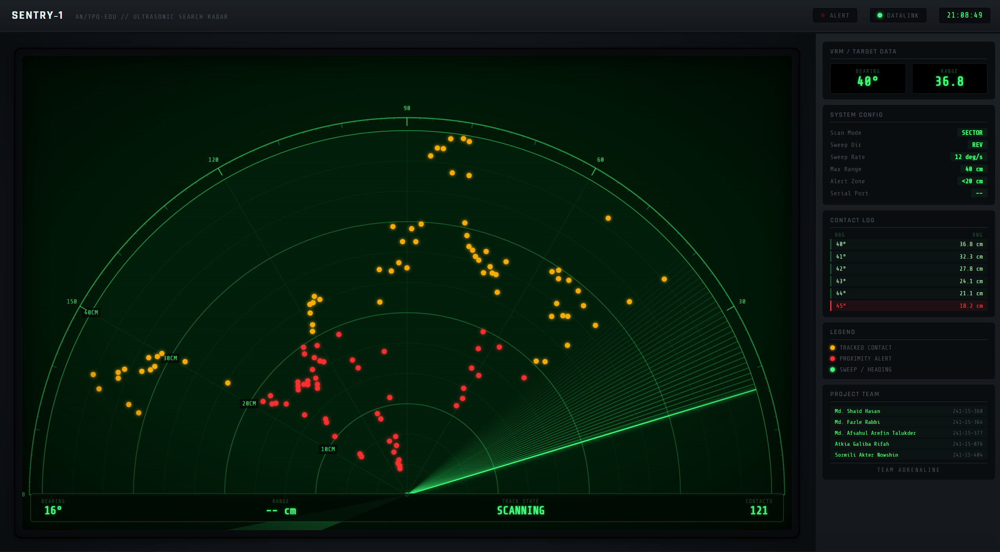

# SENTRY-1

**A Low-Cost ESP32-Based Ultrasonic Radar System with Real-Time Web-Based Visualization**

SENTRY-1 is a low-cost embedded radar prototype that combines an **ESP32**, **HC-SR04 ultrasonic sensor**, and **SG90 servo motor** with a browser-based real-time visualization dashboard.

The system performs a controlled angular sweep, measures distance, filters noisy readings, and streams radar data to a web interface through a Node.js backend and Socket.IO.

## ✨ Key Features

- 📡 Ultrasonic distance sensing with HC-SR04
- 🔄 Automated 15°–165° sector sweep
- 🎯 1° angular resolution
- 🧹 5-sample median filtering for stable measurements
- 📏 Configurable working range of approximately 2–40 cm
- 🚨 Proximity alert with active buzzer
- ⚡ ESP32-based embedded control
- 🌐 Real-time browser visualization
- 🔌 Serial communication between ESP32 and server
- 🔗 WebSocket-based streaming using Socket.IO
- 📱 Responsive radar dashboard

## 🏗️ System Architecture

```text
HC-SR04 + SG90 Servo
        │
        ▼
      ESP32
        │
        │ USB Serial
        ▼
   Node.js Server
        │
        │ Socket.IO
        ▼
 Web Radar Dashboard
```

The ESP32 controls the servo sweep and ultrasonic measurements. Sensor readings are transmitted over USB serial to the Node.js server, which forwards the data to connected browsers using Socket.IO.

## 🔧 Hardware

| Component | Purpose |
|---|---|
| ESP32 Dev Board | Main microcontroller |
| HC-SR04 | Ultrasonic distance measurement |
| SG90 Servo | Sensor angle control |
| Active Buzzer | Proximity alert |
| Breadboard | Circuit prototyping |

## 💻 Software Stack

| Layer | Technology |
|---|---|
| Firmware | Arduino / ESP32 |
| Backend | Node.js |
| Web Server | Express |
| Real-Time Communication | Socket.IO |
| Serial Communication | SerialPort |
| Frontend | HTML, CSS, JavaScript |
| Visualization | HTML5 Canvas |

## 📐 Measurement Methodology

The radar performs a sector sweep from **15° to 165°** to avoid stressing the servo near its mechanical end stops.

Key parameters include:

- Sweep range: **15°–165°**
- Step size: **1°**
- Step delay: **25 ms**
- Echo timeout: **6000 µs**
- Filter: **Median of 5 samples**
- Valid measurement range: **2–40 cm**
- Proximity alert threshold: **20 cm**

Readings outside the valid measurement range are discarded before being used for visualization.

## 🌐 Real-Time Dashboard




The browser dashboard renders incoming measurements as a radar-style visualization using HTML5 Canvas.

The Node.js backend receives ESP32 serial data and broadcasts radar measurements to connected clients through Socket.IO.

## 📁 Project Structure

```text
SENTRY-1/
├── assets/
│   └── dashboard.png
├── backend/
│   ├── server.js
│   ├── package.json
│   └── package-lock.json
├── frontend/
│   ├── index.html
│   └── radar.js
├── Rader.ino
├── .gitignore
└── README.md
```

> The firmware file is currently named `Rader.ino` in the project source.

## 🚀 Getting Started

### 1. Clone the repository

```bash
git clone https://github.com/Fazle240102/SENTRY-1.git
cd SENTRY-1
```

### 2. Install backend dependencies

From the project root:

```bash
cd backend
npm install
```

The backend uses **Express**, **Socket.IO**, **SerialPort**, and **@serialport/parser-readline**.

### 3. Upload the ESP32 firmware

Open the Arduino firmware in Arduino IDE, select the appropriate ESP32 board and serial port, then upload the firmware.

### 4. Connect the ESP32

Connect the ESP32 to the computer using USB and identify its serial port.

### 5. Start the server

From the `backend` directory:

```bash
npm start
```

The dashboard is served from the `frontend` directory at:

```text
http://localhost:3000
```

> By default, the backend expects the ESP32 on `COM10`. Set the `SERIAL_PORT` environment variable when your device uses a different port.

## 🔌 Serial & Communication Flow

```text
Ultrasonic Measurement
        ↓
ESP32 Firmware
        ↓
USB Serial
        ↓
Node.js + SerialPort
        ↓
Socket.IO
        ↓
Browser Dashboard
```

## 🧪 Validation

The system is designed to validate:

- Servo sweep and angular positioning
- Ultrasonic distance measurement
- Noise filtering
- Proximity detection
- Serial data transmission
- Real-time WebSocket communication
- Browser-side radar visualization

## 🎓 Academic Context

- **Project:** SENTRY-1
- **Project Type:** Embedded Systems / IoT / Robotics
- **Core Platform:** ESP32
- **Institution:** Daffodil International University

## 📌 Project Status

Completed academic prototype demonstrating low-cost ultrasonic sensing with real-time web-based visualization.

## 👥 Project Team

Developed collaboratively as a team project for the **Computer Science & Engineering** program at **Daffodil International University**.

